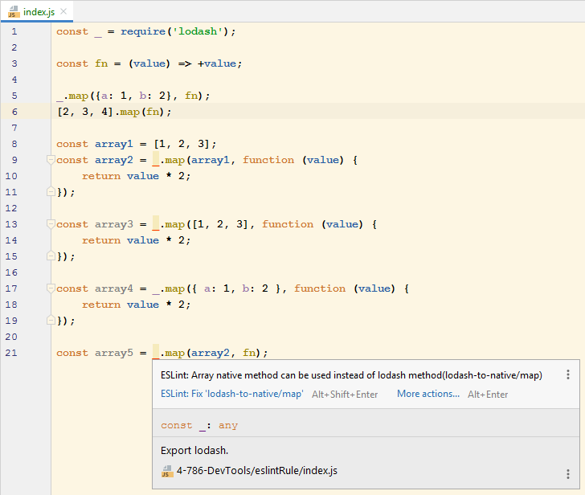

# Разработка в IDE и терминале - написание правила для ESLint

__Задание:__ Надо написать для ESLint плагин, в котором будет своё правило с фиксом. 
Правило должно находить использование функции _.map, например _.map(collection, fn), и, если это возможно, предлагать заменить его на использование нативного Array#map.

___

## Общие пояснения к заданию

Ссылка на репозиторий с плагином. Инструкции по установке и запуску находятся там же.

https://github.com/StepanovYuriy/eslint-plugin-lodash-to-native

__Также есть возможность посмотреть работу плагина в этом репозитории:__ 

1. Перейти в терминале в директорию задания: [`/4-786-DevTools/eslintRule`](./)
2. Установить зависимости `npm ci`
3. Выполнить команду `npm run lint` или открыть файл [`index.js`](./index.js) (при интегрированном ESLint в IDE)

На примере WebStorm:

___

Общий файл [README.md](../README.md) для домашней работы по Тулингу.

Общий файл [README.md](../../README.md) для всех домашних работ.