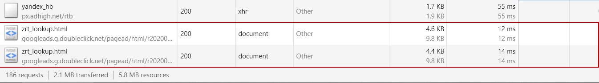
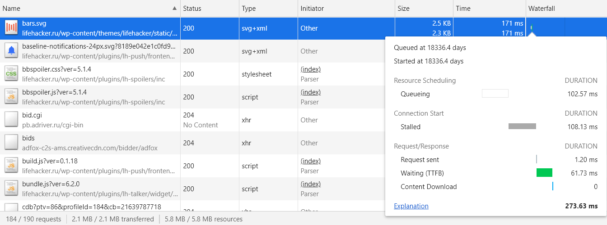

# Использование браузерных DevTools - анализ сайта

__Задание:__ Сделать анализ загрузки сайта https://lifehacker.ru в Chrome DevTools по вкладкам Network, Performance, Coverage

___

## Анализ вкладки Network

Сохранённый [профиль загрузки ресурсов](./profileNetwork.har) при открытии страницы

Найденные неоптимальные места:
+ __дублирование 13 ресурсов__. 
Устранение дублей уменьшит общее количество загружаемых ресурсов на 22. 
__-12%__ от общего количества загружаемых ресурсов.
    - [show_ads_impl_fy2019.js](https://pagead2.googlesyndication.com/pagead/js/r20200316/r20190131/show_ads_impl_fy2019.js)
    
    
    
    - [adsbygoogle.js](https://pagead2.googlesyndication.com/pagead/js/adsbygoogle.js)
    
    
    
    - [publishertag.js](https://static.criteo.net/js/ld/publishertag.js)
    
    
    
    - [osd.js?cb=%2Fr20100101](https://www.googletagservices.com/activeview/js/current/osd.js?cb=%2Fr20100101)
    
    
    
    - [ads.adfox.ru](https://ads.adfox.ru/200984/getBulk/v2?dl=https%3A%2F%2Flifehacker.ru%2F&date=2020-03-21T08%3A28%3A56.889%2B03%3A00&pd=21&pdh=1080&pdw=1920&pr1=807783362&pr=1265639273&prr=&pv=8&pw=6&extid_loader=MTU4NDc2ODM2NTU1MDM1NjYyMQ%3D%3D&extid_tag_loader=lifehacker.ru&ylv=0.1622&ybv=0.1619&ytt=327104709789717&is-turbo=0&skip-token=&ad-session-id=7660881584768536851&layout-config=%7B%22win_width%22%3A1060%2C%22win_height%22%3A501%2C%22width%22%3A300%2C%22height%22%3A0%2C%22left%22%3A683%2C%22top%22%3A3204%2C%22visible%22%3A0%2C%22req_no%22%3A2%2C%22ad_no%22%3A0%7D&enable-flat-highlight=1&yandexuid=16151346113974713055&sign=284d34513623b240f0a85ab01a4e0f72&p1=bzrqx&p2=fmvd&puid1=&puid2=&puid3=&puid4=&puid5=&pk=&pke=1&slotNumber=4&matchid-direct=1&bids=W3siY2FtcGFpZ25faWQiOjExOTc1NDYsInJlc3BvbnNlX3RpbWUiOjQ1OSwiZXJyb3IiOnsiY29kZSI6NH0sInBsYWNlbWVudF9pZCI6Ikd3NTF5MVh0ZGtlZGpBRzJ6cW9RIn0seyJjYW1wYWlnbl9pZCI6ODI1OTI3LCJyZXNwb25zZV90aW1lIjo0NzUsImVycm9yIjp7ImNvZGUiOjF9LCJwbGFjZW1lbnRfaWQiOiIzNTkxOTA2In0seyJjYW1wYWlnbl9pZCI6MTA2MjMzNCwicmVzcG9uc2VfdGltZSI6NTIzLCJlcnJvciI6eyJjb2RlIjoxfSwicGxhY2VtZW50X2lkIjoiZGlyZWN0X290bV8xNzg0In0seyJjYW1wYWlnbl9pZCI6ODQzMzAyLCJyZXNwb25zZV90aW1lIjo2MTYsImVycm9yIjp7ImNvZGUiOjF9LCJwbGFjZW1lbnRfaWQiOiIxMjE3ODE3In0seyJjYW1wYWlnbl9pZCI6NzkwODM0LCJyZXNwb25zZV90aW1lIjo3MjEsImVycm9yIjp7ImNvZGUiOjF9LCJwbGFjZW1lbnRfaWQiOiIyMzk4MDYifSx7ImNhbXBhaWduX2lkIjoxMTk3NTcyLCJyZXNwb25zZV90aW1lIjo3MzMsImVycm9yIjp7ImNvZGUiOjR9LCJwbGFjZW1lbnRfaWQiOiI1NDpsaWZlaGFja2VyXzMwMHg2MDBfMiJ9LHsiY2FtcGFpZ25faWQiOjgzNzg0NiwicmVzcG9uc2VfdGltZSI6NzQ3LCJiaWQiOjMyMiwiY3VycmVuY3kiOiJSVUIiLCJ1bml0IjoyLCJwbGFjZW1lbnRfaWQiOiIxMThfTEhfU2lkZWJhcl8yX2RfMzAweDYwMCJ9LHsiY2FtcGFpZ25faWQiOjExOTc2ODgsInJlc3BvbnNlX3RpbWUiOjc2NiwiZXJyb3IiOnsiY29kZSI6MX0sInBsYWNlbWVudF9pZCI6IjVkZGU1NzVmYWFkMDY2MTM3NGVkNzNhNiJ9LHsiY2FtcGFpZ25faWQiOjExOTc2OTMsInJlc3BvbnNlX3RpbWUiOjE5MzIsImVycm9yIjp7ImNvZGUiOjF9fSx7ImNhbXBhaWduX2lkIjo3Nzc5MzUsInJlc3BvbnNlX3RpbWUiOjM0NzIsImVycm9yIjp7ImNvZGUiOjF9LCJwbGFjZW1lbnRfaWQiOiIxNDYzNjkwIn1d&grab=dNCb0LDQudGE0YXQsNC60LXRgCAtINGB0L7QstC10YLRiyDQuCDQu9Cw0LnRhNGF0LDQutC4LCDQv9GA0L7QtNGD0LrRgtC40LLQvdC-0YHRgtGMLCDRgtC10YXQvdC-0LvQvtCz0LjQuCwg0LfQtNC-0YDQvtCy0YzQtQoy0JrQsNC6INGB0YLQsNGC0Ywg0LzQuNC70LvQuNC-0L3QtdGA0L7QvCAKMjE2INCy0LXRidC10LksINC60L7RgtC-0YDRi9C1INGB0YLQvtC40YIg0YHQtNC10LvQsNGC0YwsINC_0L7QutCwINCy0Ysg0LzQvtC70L7QtNGLIAoy0JrQsNC6INC-0LHRidCw0YLRjNGB0Y8g0YEg0YHQvtGG0LjQvtC_0LDRgtC-0LwgCjLQktGB0ZEsINGH0YLQviDQvdGD0LbQvdC-INC30L3QsNGC0Ywg0L4g0LrQvtGA0L7QvdCw0LLQuNGA0YPRgdC1IAoy0J7QsdC-0Lgg0YEg0L3QvtCy0L7Qs9C-IGlQYWQgUHJvINGD0LbQtSDQvNC-0LbQvdC-INGB0LrQsNGH0LDRgtGMINC90LAg0LvRjtCx0L7QtSDRg9GB0YLRgNC-0LnRgdGC0LLQviAKMtCX0LDQv9C10YfRkdC90L3QsNGPINGA0YvQsdCwINCyINGF0YDRg9GB0YLRj9GJ0LXQuSDQv9Cw0L3QuNGA0L7QstC60LUgCjLQm9Cw0LnRhNGF0LDQujog0LrQsNC6INC40LfQsdC10LPQsNGC0Ywg0LHQtdGB0L_QvtC70LXQt9C90YvRhSDRgdC-0LLQtdGJ0LDQvdC40Lkg0YfQtdGA0LXQtyBab29tIAoyQWxpRXhwcmVzcyDQuCDQvdC1INGC0L7Qu9GM0LrQvjog0YHQsNC80YvQtSDQuNC90YLQtdGA0LXRgdC90YvQtSDQvdCw0YXQvtC00LrQuCDQtNC90Y8gCjLQlNC-0LzQsNGI0L3QtdC1INC80L7RgNC-0LbQtdC90L7QtSDQuNC3INGB0LvQuNCy0L7QuiDRgdC-INGB0LPRg9GJ0ZHQvdC60L7QuSDQuCDQutC-0YTQtSAKMtCS0LjQtNC10L4g0LTQvdGPOiDQtNC10LzQvtC90YHRgtGA0LDRhtC40Y8g0L3QvtCy0L7Qs9C-INC00LjQt9Cw0LnQvdCwIFdpbmRvd3MgMTAgCjLQmtC-0LPQtNCwINGA0LXQsdGR0L3QvtC6INC90LDRh9C40L3QsNC10YIg0LTQtdGA0LbQsNGC0Ywg0LPQvtC70L7QstGDINC4INC60LDQuiDQtdC80YMg0LIg0Y3RgtC-0Lwg0L_QvtC80L7Rh9GMIAoyMTYg0YPQtNC40LLQuNGC0LXQu9GM0L3Ri9GFINC80LXRgdGCINCyINCg0L7RgdGB0LjQuCwg0LPQtNC1INC00L7Qu9C20LXQvSDQv9C-0LHRi9Cy0LDRgtGMINC60LDQttC00YvQuSAKMtCn0YLQviDRgtCw0LrQvtC1INGA0YPQvNC40L3QsNGG0LjRjyDQuCDQutCw0Log0L_QtdGA0LXRgdGC0LDRgtGMINCy0YHRkSDQsNC90LDQu9C40LfQuNGA0L7QstCw0YLRjCAKMtCR0YPQu9C-0YfQutC4INGBINC80Y_RgdC-0LwsINGI0LDQvNC_0LjQvdGM0L7QvdCw0LzQuCDQuCDQv9GA0Y_QvdC-0YHRgtGP0LzQuCAKMjUg0L_RgNC40YfQuNC9INC_0LXRgNC10LXRhdCw0YLRjCDQsiDQm9C10YTQvtGA0YLQvtCy0L4gCjLQntC_0YDQvtGBOiDRh9GC0L4g0LLQutGD0YHQvdC-0LPQviDQuCDQvdC10L7QsdGL0YfQvdC-0LPQviDQstGLINC60YPQv9C40LvQuCDQvdCwINC60LDRgNCw0L3RgtC40L0_IAoy0KfRgtC-INC_0YDQuNCz0L7RgtC-0LLQuA%3D%3D&utf8=%E2%9C%93)
    
    
    
    - [adfox-adx-stub.html](https://yastatic.net/pcode/adfox/adfox-adx-stub.html)
    - [adfox-adx-stub.js](https://yastatic.net/pcode/adfox/adfox-adx-stub.js)
    
    
    
    - [ckq-BLGbg480ujf2K0UQ2zQDu-BvCo9Xhy5fyHAuIG0.js](https://pagead2.googlesyndication.com/bg/ckq-BLGbg480ujf2K0UQ2zQDu-BvCo9Xhy5fyHAuIG0.js)
    
    
    
    - [cookie.js?domain=lifehacker.ru](https://partner.googleadservices.com/gampad/cookie.js?domain=lifehacker.ru&callback=_gfp_s_&client=ca-pub-1967979736935021&cookie=ID%3Df5b1d12ca8074997%3AT%3D1584768372%3AS%3DALNI_Mbtuk0jI8blDSIACoJL8-_8PsawiQ&crv=1)
    
    
    
    - [integrator.js?domain=lifehacker.ru](https://adservice.google.com/adsid/integrator.js?domain=lifehacker.ru)
    
    
    
    - [pixel?google_gm=AMnCDopiQD504ykw](https://fcmatch.google.com/pixel?google_gm=AMnCDopiQD504ykw-4lWKSTyLkIjbbORLp7zBNwCnEO7yD3h1XeVvCF4BM8UGNqVQLirxs6PCuunRxstSDaZmsyxM72vcyTkC93CeVhoF8bma5G0U5adzSM)
    
    
    
    - [sodar?sv=200&tid=gda&tv=r20200316&st=env](https://pagead2.googlesyndication.com/getconfig/sodar?sv=200&tid=gda&tv=r20200316&st=env)
    
    
    
    - [zrt_lookup.html](https://googleads.g.doubleclick.net/pagead/html/r20200316/r20190131/zrt_lookup.html)
    
    
    
___
    
+ __лишний размер минимум 1 ресурса__. 
Сложно оценить, с какого значения и как считать лишний размер, однако [один файл](https://lifehacker.ru/wp-content/uploads/2020/02/oblozhka-sajt_1582038972-630x315.png) явно выделяется. 
Без особых сложностей удалось уменьшить размер этого файла в 5 раз.
 __-10%__ от общего количества скачиваемых ресурсов.
Также надо отметить тот факт, что контент меняется, и эти данные могут очень сильно отличаться в большую сторону.

___

+ __медленно загружающиеся ресурсы (минимум 3)__.
Также сложно оценить без какого-то заданного значения "медленность" загрузки.
Для себя я выбрал также явно отличающиеся от других ресурсы.
Более 500ms время скачивания контента (метрика Content Downloaded).

    - Общий список отсортированный по столбцу Time
    
    

    - [__fpn.gif](https://fpn.flipboard.com/pix/__fpn.gif?utm_source=https%3A%2F%2Flifehacker.ru%2F)
    
    

    - [ga-audiences?v=1](https://www.google.com/ads/ga-audiences?v=1&aip=1&t=sr&_r=4&tid=UA-2508720-2&cid=1959837915.1584768365&jid=2006458724&_v=j81&z=1595217211)
    
    

    - [collect?v=1](https://www.google-analytics.com/r/collect?v=1&_v=j81&a=520993720&t=pageview&_s=1&dl=https%3A%2F%2Flifehacker.ru%2F&ul=ru-ru&de=UTF-8&dt=%D0%9B%D0%B0%D0%B9%D1%84%D1%85%D0%B0%D0%BA%D0%B5%D1%80%20-%20%D1%81%D0%BE%D0%B2%D0%B5%D1%82%D1%8B%20%D0%B8%20%D0%BB%D0%B0%D0%B9%D1%84%D1%85%D0%B0%D0%BA%D0%B8%2C%20%D0%BF%D1%80%D0%BE%D0%B4%D1%83%D0%BA%D1%82%D0%B8%D0%B2%D0%BD%D0%BE%D1%81%D1%82%D1%8C%2C%20%D1%82%D0%B5%D1%85%D0%BD%D0%BE%D0%BB%D0%BE%D0%B3%D0%B8%D0%B8%2C%20%D0%B7%D0%B4%D0%BE%D1%80%D0%BE%D0%B2%D1%8C%D0%B5&sd=24-bit&sr=1920x1080&vp=1043x501&je=0&_u=QACAAEAB~&jid=2006458724&gjid=285049585&cid=1959837915.1584768365&tid=UA-2508720-2&_gid=1242403241.1584768365&_r=1&cd10=%D0%9B%D0%B8%D0%BA%D0%B1%D0%B5%D0%B7&z=1595217211)
    
    
    
___

+ __ресурсы, блокирующие загрузку (минимум 3)__.
Аналогично я выбрал также наиболее отличающиеся от других ресурсы.
Более 100ms время блокировки (метрика Stalled).

    - [https://banner.hpmdnetwork.ru/](https://banner.hpmdnetwork.ru/)
        
    
    
    - [getCode?p1](https://ads.adfox.ru/200984/getCode?p1=bzwbj&p2=frfe&pfc=cgyxl&pfb=gseyc&puid1=&puid2=&puid3=&puid4=&puid5=&puid6=&puid7=&puid8=&pr=[RANDOM]&ptrc=b)
        
    
    
    - [bars.svg](https://lifehacker.ru/wp-content/themes/lifehacker/static/img/bars.svg)
        
    
    
___

+ __что-то ещё__
        
    - Разные шрифты, расширения шрифтов и их версии. Нет альтернативных шрифтов на время загрузки основных.
    
    
    
___

## Анализ вкладки Performance

Сохранённый [профиль загрузки страницы](./profilePerformance.json)

Время в миллисекундах от начала навигации до событий:

+ First Paint - __1158.1 ms__
+ First Meaningful Paint - __3344.0 ms__
+ DOM Content Loaded - __5750.6 ms__
+ Load - __8703.5 ms__

___

Время в миллисекундах потраченное на разные этапы обработки документа:
+ Loading - __226 ms__
+ Scripting - __4556 ms__
+ Rendering - __3362 ms__
+ Painting - __338 ms__

___

## Анализ вкладки Coverage

Сохранённый [профиль](./profileCoverage.json)

Cкриншот вкладки после загрузки страницы

+ Объём неиспользованного CSS в ходе загрузки страницы - __~391 Kb__

+ Объём неиспользованного JS в ходе загрузки страницы - __~1386 Kb__

## Общие впечатления после анализа

+ Есть явные проблемы с количеством рекламы и метриками, а также с их приоритетом загрузки и выполнения.
Это сильно влияет на отображение значимого контента и элементов сайта.
+ Нет альтернативных шрифтов на время загрузки основных. 
Получаются пустые области на экране, что явно видно на скриншотах при профилировании.
Также некоторые шрифты вообще не используются, хотя загружаются
+ Достаточно большой объём неиспользуемого кода и стилей
+ Поскольку контент меняется, то периодически проскакивают при загрузке достаточно большие изображения использующиеся в статьях (__~1-3 Mb__). 
Такие изображения можно сжимать без заметного снижения качества при создании статьи и не хранить их оригиналы
