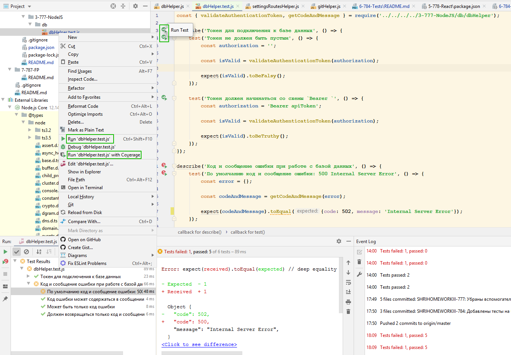

# SHRIHOMEWORKIII-784 - Тесты

## Общие пояснения к работе

Все файлы, относящиеся к этому домашнему заданию, находятся в папке [`/6-784-Tests`](./)

[Модульные тесты](./unit)

[Интеграционные тесты](./integration)

## Подготовка к запуску тестов

1. [Запустить](../3-777-NodeJS/README.md) серверную часть приложения
2. [Запустить](../5-778-React/README.md) клиентскую часть приложения
3. Перейти в терминале в директорию задания: [`/6-784-Tests`](./)
4. Установить зависимости `npm сi`

___

## Запуск модульных тестов

Варианты запуска:

1. `unit-test` - разовый запуск модульных автотестов
2. `unit-test-watch` - запуск модульных автотестов в режиме watch
3. Запуск нужных тестов из интерфейса IDE WebStorm

___

## Пояснения по расположению файлов

Все файлы с тестами находятся отдельно, но при этом повторяют файловую структуру проверяемых модулей.

На мой взгляд это позволит проще проверять домашнее задание. 
Также при переводе клиентской части на TypeScript не будет проблемы с написанием новых/доработкой старых тестов.

Минусом такого подхода можно считать дополнительное создание package.json со своими зависимостями.
Поскольку это проект для обучения, то я считаю, что этим можно пренебречь.

___

Общий файл [README.md](../README.md) для всех домашних работ.
